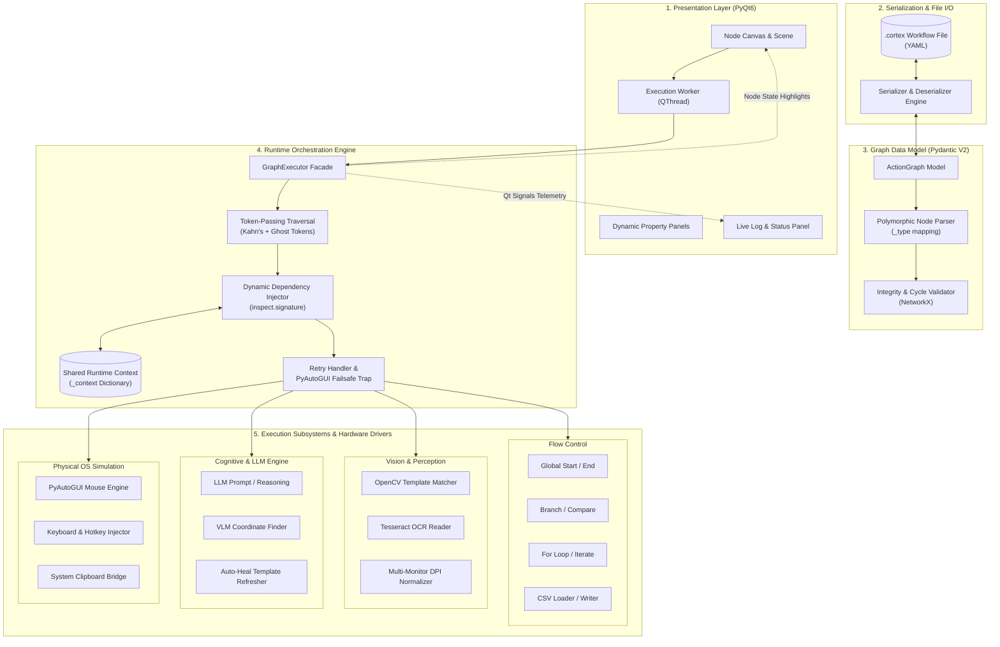
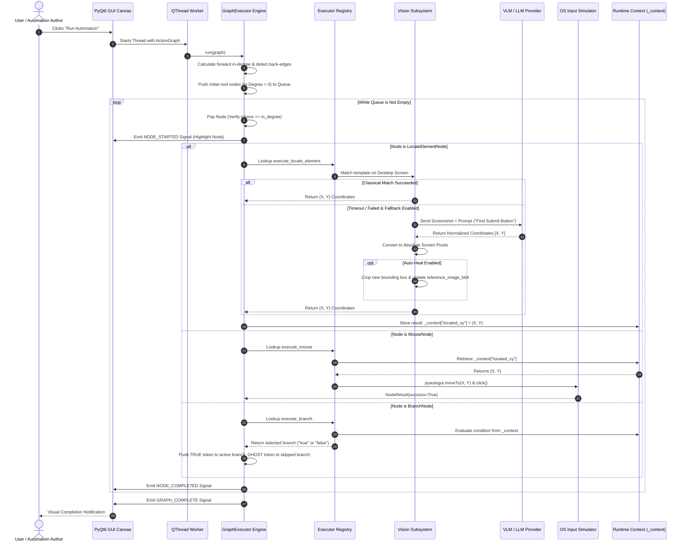
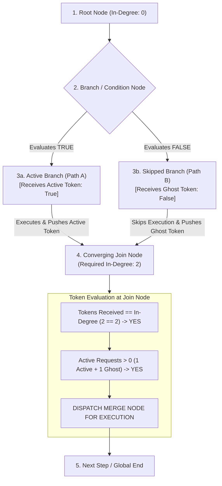
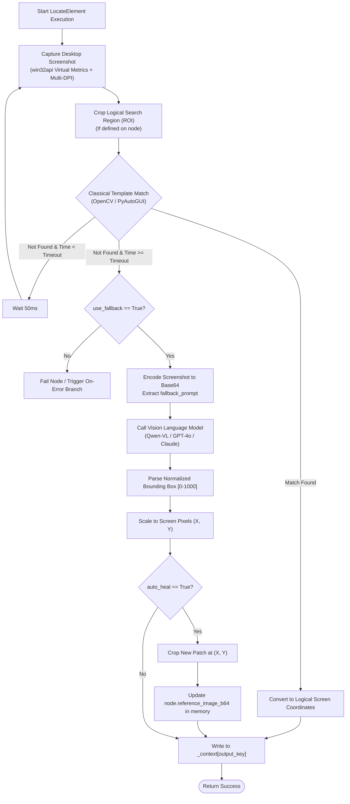
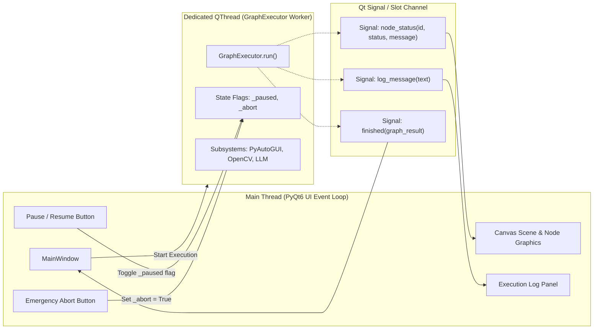

# Cortex — Architecture & System Design Guide

> **LLM-Powered Cross-Platform Desktop & OS Automation Framework**  
> *A high-resilience, node-based visual execution engine combining Computer Vision, Large Language Models (VLMs), and Physical OS Simulation.*

---

## Table of Contents

1. [System Overview](#1-system-overview)
2. [Master Diagramming Guide: What to Put in Architectural Diagrams](#2-master-diagramming-guide-what-to-put-in-architectural-diagrams)
3. [Visual Architectural Diagrams (Mermaid)](#3-visual-architectural-diagrams-mermaid)
   - [3.1 High-Level Layered Architecture](#31-high-level-layered-architecture)
   - [3.2 End-to-End Information & Data Flow](#32-end-to-end-information--data-flow)
   - [3.3 Token-Passing Graph Traversal (Petri-Net Style)](#33-token-passing-graph-traversal-petri-net-style)
   - [3.4 Vision Subsystem with VLM Fallback & Self-Healing](#34-vision-subsystem-with-vlm-fallback--self-healing)
   - [3.5 Multi-Threaded GUI & Runtime Synchronization](#35-multi-threaded-gui--runtime-synchronization)
4. [Architectural Decision Records (ADRs)](#4-architectural-decision-records-adrs)
   - [ADR-001: Token-Passing Traversal vs Recursive / Naive DAG Sort](#adr-001-token-passing-traversal-vs-recursive--naive-dag-sort)
   - [ADR-002: Decoupled Data Model & Executor Registry Pattern](#adr-002-decoupled-data-model--executor-registry-pattern)
   - [ADR-003: Dynamic Dependency Injection via Signature Introspection](#adr-003-dynamic-dependency-injection-via-signature-introspection)
   - [ADR-004: Dual-Tier Vision Subsystem with Self-Healing](#adr-004-dual-tier-vision-subsystem-with-self-healing)
   - [ADR-005: Shared State Context (`_context`) & Jinja2 Template Interpolation](#adr-005-shared-state-context-_context--jinja2-template-interpolation)
   - [ADR-006: Asynchronous QThread Isolation & Non-Blocking State Machine](#adr-006-asynchronous-qthread-isolation--non-blocking-state-machine)
   - [ADR-007: Micro-Component / Facade Architectural Pattern](#adr-007-micro-component--facade-architectural-pattern)
5. [Core Subsystems & Codebase Structure](#5-core-subsystems--codebase-structure)
6. [Node Execution Lifecycle & Context Flow](#6-node-execution-lifecycle--context-flow)
7. [Getting Started & Usage](#7-getting-started--usage)

---

## 1. System Overview

**Cortex** is an enterprise-grade automation framework designed to bridge the gap between traditional UI scripting (fragile selectors and pixel coordinates) and cognitive artificial intelligence. It allows users to visually author, serialize, and execute complex desktop automation pipelines.

```
┌─────────────────────────────────────────────────────────────────────────┐
│                                 CORTEX                                  │
├───────────────────┬───────────────────────────────┬─────────────────────┤
│    THE EYES       │           THE BRAIN           │      THE HANDS      │
│  Computer Vision  │  Large Language Models (VLM)  │   Physical OS I/O   │
│ OpenCV + OCR ROI  │ Reasoning, Extraction, Healing│  Mouse, Keys, Clips │
└───────────────────┴───────────────────────────────┴─────────────────────┘
```

### Key Differentiators:
- **Token-Passing Traversal Engine**: Solves the classic converging diamond deadlock, skips bypassed branches cleanly using ghost tokens, and handles cyclic loops without Python recursion limits.
- **Self-Healing Vision**: When template matching fails due to UI drift, a Vision-Language Model (VLM) identifies target coordinates and automatically updates the node's template image in memory.
- **Human-Indistinguishable Physical I/O**: Direct OS-level mouse movements, clicks, keyboard events, and clipboard operations bypassing web anti-bot shields.
- **Dynamic Dependency Injection**: Executor functions specify only the arguments they need (`abort_signal`, `emit_info`, `llm_config`), dynamically injected at runtime.

---

## 2. Master Diagramming Guide: What to Put in Architectural Diagrams

Agar aapko is project ka architecture visually represent karna hai (jaise **Excalidraw, Draw.io, Lucidchart, Miro ya Presentation Slides** mein), toh niche di gayi list ke anusar components aur information flow ko show karein:

### A. List of Core Blocks / Components to Include in the Diagram
1. **User Interface Tier (Presentation)**:
   - **PyQt6 Canvas & Scene**: Visual Node Graph, Ports (Inputs/Outputs), Bezier Curve Edges.
   - **Property Panel & Builders**: Dynamic form inspectors for Node configuration.
   - **Radial / Context Menus**: Node creation and palette system.
   - **Live Log & Execution Visualizer**: Highlights running node, success/failure glows, log messages.
2. **Storage & Serialization Tier**:
   - **`.cortex` File (YAML)**: Master blueprint storing Graph metadata, LLM config, node dictionary, and edge list.
   - **Serializer / Deserializer Engine**: Converts disk YAML into validated in-memory Pydantic objects.
3. **Graph Data Model & Validation Tier**:
   - **`ActionGraph` (Pydantic V2 Master Model)**: Holds all nodes and edges.
   - **Polymorphic Type Dispatcher (`parse_nodes`)**: Resolves `_type` string into concrete node models (`LocateElementNode`, `MouseNode`, `BranchNode`, etc.).
   - **NetworkX Topology Validator**: Validates connectivity, entry node existence, and loop structures before execution.
4. **Runtime Execution Engine (Orchestrator)**:
   - **`GraphExecutor` (Facade)**:
     - `CoreExecutorMixin`: State flags (`_paused`, `_abort`, `_context`).
     - `DispatchMixin`: Registry lookup, dynamic dependency injection, retry loop (`max_retries`, `retry_delay`).
     - `ExecutionMixin`: Token-passing traversal loop, in-degree calculation, queue management.
   - **Token Engine**: `node_tokens` (accumulated tokens) vs `node_exec_requests` (active execution vs ghost skip tokens).
   - **DFS Cycle Detector**: Segregates forward edges from back-edges for loop handling.
5. **Node Executors & Subsystems (Workers)**:
   - **Flow Executors**: `GlobalStart`, `GlobalEnd`, `Branch`, `Compare`, `ForLoop`, `Iterate`, `Wait`, `CSVDataLoader`, `CSVWriter`.
   - **Vision Subsystem**: `LocateElement`, `LocateAndClick`, `OCR`, multi-monitor DPI normalizer, cropped ROI generator.
   - **LLM / VLM Subsystem**: Prompt renderer (Jinja2), OpenAI/OpenRouter client, Structured judgment/extraction, AI Fallback & Self-Healing handler.
   - **Physical Subsystem**: `PyAutoGUI` / `PyWin32` mouse controller, keyboard synthesizer, system clipboard bridge.
6. **Threading & IPC Boundary**:
   - **Main UI Thread**: Handles user interactions, pan/zoom, node dragging.
   - **Worker Thread (`QThread`)**: Runs the blocking automation loop.
   - **Signals / Slots Bus**: Emits `ExecutionStatus` (`NODE_STARTED`, `NODE_COMPLETED`, `NODE_FAILED`, `GRAPH_COMPLETE`, `GRAPH_ABORTED`).

---

### B. List of Information Flows to Trace with Arrows in Diagrams

| Step | Flow Name | Source Component | Target Component | Data Payload / Action |
| :--- | :--- | :--- | :--- | :--- |
| **1** | **Workflow Load** | `.cortex` File | `Serializer (YAML Loader)` | Raw YAML string containing nodes, edges, LLM config |
| **2** | **Graph Validation** | `Serializer` | `ActionGraph (Pydantic)` | Dict parsed via `parse_nodes` into polymorphic Pydantic objects |
| **3** | **Execution Start** | UI Run Button | `Worker Thread (QThread)` | Passes `ActionGraph` instance to `GraphExecutor.run()` |
| **4** | **Topology Setup** | `GraphExecutor` | `NetworkX & DFS` | Evaluates forward in-degree and detects back-edges |
| **5** | **Token Dispatch** | `Execution Queue` | `DispatchMixin` | Pops ready node (`tokens == in_degree` & `exec_requests > 0`) |
| **6** | **Dependency Injection** | `DispatchMixin` | `Executor Function` | Injects `(node, _context, abort_signal, emit_info, llm_config)` |
| **7** | **State Read / Action** | `Executor Function` | OS / Vision / LLM API | Reads `_context[input_key]`, captures screen / clicks / calls LLM |
| **8** | **Context Mutation** | `Executor Function` | `_context` (Shared Map) | Writes result: `_context[node.output_key] = result_value` |
| **9** | **Token Propagation** | `DispatchMixin` | `Child Nodes (Queue)` | Pushes `True` tokens to active branch, `False` ghost tokens to skipped branches |
| **10**| **UI Telemetry** | `GraphExecutor` | Main UI / Log Panel | Emits Qt Signals with node status, runtime logs, and error states |

---

## 3. Visual Architectural Diagrams (Mermaid)

### 3.1 High-Level Layered Architecture



---

### 3.2 End-to-End Information & Data Flow



---

### 3.3 Token-Passing Graph Traversal (Petri-Net Style)

This diagram highlights how Cortex prevents deadlocks on converging branches (the diamond pattern) using **Ghost Tokens**:



---

### 3.4 Vision Subsystem with VLM Fallback & Self-Healing



---

### 3.5 Multi-Threaded GUI & Runtime Synchronization



---

## 4. Architectural Decision Records (ADRs)

### ADR-001: Token-Passing Traversal vs Recursive / Naive DAG Sort
* **Context**: Traditional node engines use simple recursive traversal (`node.execute() -> child.execute()`) or static Kahn topological sorting. In UI automation, workflows require complex conditional branching, converging joins (diamonds), and iterative loops.
* **Decision**: Implement a **Token-Passing Queue Traversal Engine** inspired by Petri nets and Kahn's algorithm.
* **Rationale**:
  - Eliminates Python `RecursionError` on large workflows.
  - Solves the Converging Diamond deadlock: when a conditional branch skips a path, it pushes "ghost" tokens (`exec=False`) so downstream joining nodes satisfy their in-degree requirements without executing twice.
  - DFS pre-pass identifies back-edges, enabling iterative `do-while` / `for` loops within a DAG-based paradigm.

---

### ADR-002: Decoupled Data Model & Executor Registry Pattern
* **Context**: Coupling execution code directly inside graph node classes bloats serializable data structures and makes headless / remote testing difficult.
* **Decision**: Strict separation of concerns:
  1. `cortex.graph_model`: Pure Pydantic V2 data models (storing properties, labels, serialization schemas).
  2. `cortex.nodes.executors`: Pure Python functions handling runtime logic.
  3. `cortex.runtime.registry`: Central mapping (`EXECUTOR_REGISTRY`) binding data models to executor functions.
* **Rationale**:
  - Clean serialization to/from YAML without executable code overhead.
  - Zero-effort mockability for automated unit and integration tests.
  - Easy addition of new node types without altering engine internals.

---

### ADR-003: Dynamic Dependency Injection via Signature Introspection
* **Context**: Different executor functions require different engine capabilities (e.g., LLM nodes need `llm_config`, loops need `abort_signal`, vision nodes need `emit_info`). Passing a monolithic engine object creates tight coupling.
* **Decision**: Use `inspect.signature` introspection at dispatch time (`DispatchMixin._dispatch`) to inspect required parameters and inject only requested dependencies.
* **Rationale**:
  - Executor functions remain pure, modular, and cleanly testable.
  - Signatures are cached in memory for sub-microsecond invocation speeds.

---

### ADR-004: Dual-Tier Vision Subsystem with Self-Healing
* **Context**: Pure pixel template matching is blazing fast and free, but breaks when UI colors or layouts subtly change. Pure LLM/VLM vision is resilient but slow (~2s) and incurs API costs.
* **Decision**: Implement a tiered fallback architecture:
  - **Tier 1 (Fast Path)**: Multi-scale OpenCV template matching.
  - **Tier 2 (Fallback Path)**: High-resolution desktop screenshot dispatched to a Vision-Language Model.
  - **Auto-Healing**: Upon VLM success, crop the new image patch and overwrite `reference_image_b64` in memory, restoring Tier 1 speed for subsequent runs.
* **Rationale**: Gives 99.9% reliability with near-zero average API cost.

---

### ADR-005: Shared State Context (`_context`) & Jinja2 Template Interpolation
* **Context**: Nodes must communicate data (e.g., extracted OCR text, LLM decisions, mouse coordinates) downstream without explicit point-to-point data wire clutter.
* **Decision**: Maintain a thread-safe `_context: dict[str, Any]` dictionary inside `GraphExecutor`. Every node defines an optional `output_key` to write, and consumer nodes reference keys via string selectors or Jinja2 syntax (e.g., `Hello {{ username }}`).
* **Rationale**: Keeps the visual canvas clean, supports dynamic string formatting, and enables data inspection at every step.

---

### ADR-006: Asynchronous QThread Isolation & Non-Blocking State Machine
* **Context**: UI automations perform long-running blocking operations (delays, screen grabs, network requests). Running these on the UI thread freezes the application window.
* **Decision**: Execute all graph traversals inside a dedicated `QThread` worker. Engine state transitions (`_paused`, `_abort`) are checked between loop iterations, and FailSafe mouse triggers terminate the graph instantly.
* **Rationale**: 60 FPS silky smooth UI, instant pause/resume, and hardware-level safety aborts.

---

### ADR-007: Micro-Component / Facade Architectural Pattern
* **Context**: Complex modules (like `main_window.py`, `engine.py`, `property_panel.py`) tend to grow into thousands of lines of unmaintainable monolithic code.
* **Decision**: Break large modules into `*_components/` directories. The root file acts as a clean Facade inheriting from granular mixin classes.
* **Rationale**: High maintainability, strict separation of concerns, and clean team collaboration without git merge conflicts.

---

## 5. Core Subsystems & Codebase Structure

```
cortex/
├── __init__.py
├── __main__.py                      # CLI / Package entry point
├── main.py                          # Application startup, DPI configuration, Qt bootstrap
│
├── graph_model/                     # Pydantic V2 Graph Data Structures
│   ├── base.py                      # BaseNode, BaseEdge, GraphMetadata
│   ├── edges.py                     # ActionEdge with condition labels
│   ├── enums.py                     # NodeCategory, NodeType, ExecutionStatus
│   ├── flow.py                      # Flow nodes (Start, End, Branch, Loop, CSV)
│   ├── physical.py                  # Physical nodes (Mouse, Keyboard, Clipboard)
│   ├── vision.py                    # Vision nodes (Locate, OCR, Click)
│   ├── llm.py                       # LLM nodes & LLMConfig
│   └── graph.py                     # ActionGraph master model & topology validators
│
├── serializer/                      # Workflow Serialization Engine
│   ├── file_io/                     # YAML load & save (.cortex files)
│   ├── ipc/                         # JSON serializers for IPC & web bridges
│   └── factory/                     # Default graph & template constructors
│
├── runtime/                         # Graph Execution Engine
│   ├── engine.py                    # GraphExecutor Facade
│   ├── executor.py                  # Base executor interface
│   ├── models.py                    # NodeResult, ExecutionContext
│   ├── registry.py                  # EXECUTOR_REGISTRY model-to-function mapping
│   └── engine_components/
│       ├── core.py                  # CoreExecutorMixin (context & lifecycle)
│       ├── dispatch.py              # DispatchMixin (dependency injection & retry logic)
│       ├── execution.py             # ExecutionMixin (token-passing traversal loop)
│       └── execution_graph.py       # DFS cycle detection & in-degree calculators
│
├── nodes/                           # Business Logic & Driver Implementations
│   └── executors/
│       ├── flow/                    # Start, End, Branch, Loop, CSV, Wait handlers
│       ├── physical_components/     # PyAutoGUI mouse, keyboard, clipboard handlers
│       ├── vision_components/       # OpenCV template match, OCR, VLM fallback & healing
│       └── llm.py                   # OpenAI / OpenRouter prompt execution
│
├── llm/                             # LLM Client & Template Rendering
│   ├── client.py                    # Unified LLM provider client
│   ├── templates.py                 # Jinja2 prompt interpolation engine
│   └── structured.py                # JSON extraction & judgment helpers
│
└── gui/                             # PyQt6 Visual Node Canvas & Panels
    ├── main_window.py               # Main Window Facade
    ├── canvas/                      # GraphicsScene, GraphicsView, Nodes, Ports, Edges
    ├── panels/                      # Property Inspector, Live Log Panel
    └── constants.py                 # Design tokens, color palette, node styling
```

---

## 6. Node Execution Lifecycle & Context Flow

Every single node in Cortex executes under a standardized lifecycle:

```
                  ┌──────────────────────────────┐
                  │ 1. Engine Pops Node from Q   │
                  └──────────────┬───────────────┘
                                 ▼
                  ┌──────────────────────────────┐
                  │ 2. Check Paused / Aborted    │
                  └──────────────┬───────────────┘
                                 ▼
                  ┌──────────────────────────────┐
                  │ 3. Dispatch & Inject Param   │
                  └──────────────┬───────────────┘
                                 ▼
                  ┌──────────────────────────────┐
                  │ 4. Read State from _context  │
                  └──────────────┬───────────────┘
                                 ▼
                  ┌──────────────────────────────┐
                  │ 5. Perform Action (CV/OS/LLM)│
                  └──────────────┬───────────────┘
                                 ▼
                    ┌──────────────────────────┐
         ┌──────────┤ 6. Evaluation Succeeded? ├──────────┐
         │          └──────────────────────────┘          │
      [ YES ]                                          [ NO ]
         ▼                                                ▼
┌─────────────────────────────┐               ┌─────────────────────────────┐
│ Store in _context[out_key]  │               │ Check retry_count > 0?      │
│ Push TRUE tokens to branch  │               │ [If yes: wait & retry]      │
│ Emit NODE_COMPLETED to UI   │               │ [If no: follow error edge]  │
└─────────────────────────────┘               └─────────────────────────────┘
```

---

## 7. Getting Started & Usage

### Prerequisites
- **Python**: `>= 3.11`
- **Operating System**: Windows 10/11, macOS, or Linux (X11)
- **API Key**: Optional `OPENAI_API_KEY` or `OPENROUTER_API_KEY` for AI features

### Installation
```bash
# 1. Clone repository and navigate to root
cd cortex

# 2. Create virtual environment
python -m venv venv
venv\Scripts\activate      # Windows
# source venv/bin/activate # macOS/Linux

# 3. Install in editable mode
pip install -e .
```

### Launching the Application
```bash
# Launch GUI Canvas
python -m cortex

# Or via console script entry point
cortex
```
