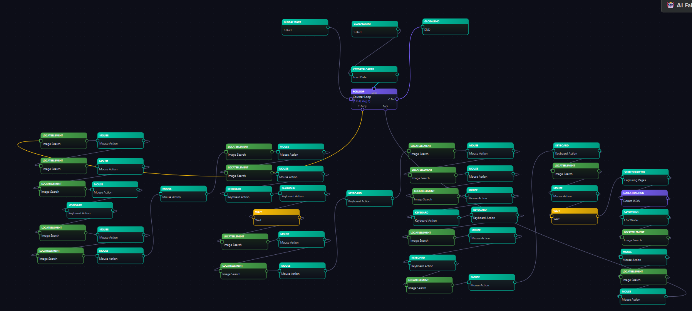
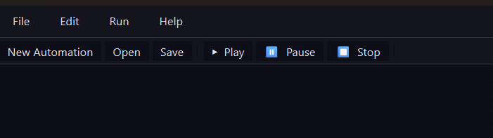
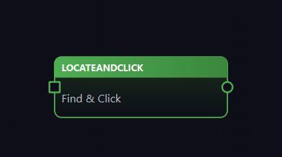
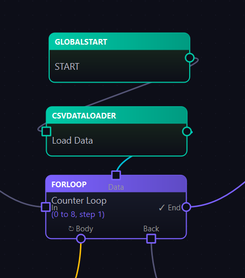
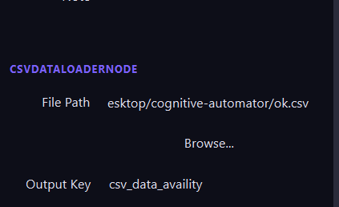
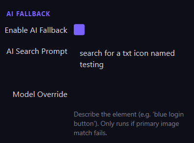
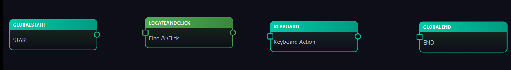
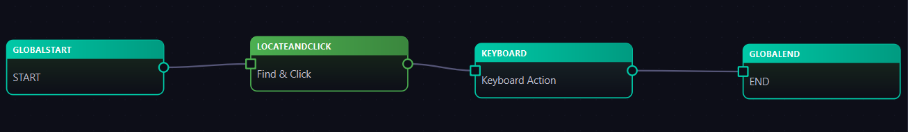

# Cognitive Automator — Getting Started Guide

---

## Table of Contents

- [Overview](#overview)
- [User Interface](#user-interface)
  - [Adding Nodes Manually](#adding-nodes-manually)
- [1. Node Reference (Comprehensive Guide)](#1-node-reference-comprehensive-guide)
  - [Base Node (Common Parameters)](#base-node-common-parameters)
  - [A. Physical I/O Nodes](#a-physical-io-nodes)
    - [MouseNode](#1-mousenode)
    - [KeyboardNode](#2-keyboardnode)
    - [ClipboardNode](#3-clipboardnode)
    - [NavigatorNode](#4-navigatornode)
    - [FileDropNode](#5-filedropnode)
    - [ScreenshotterNode](#6-screenshotternode)
  - [B. Vision Nodes](#b-vision-nodes)
    - [LocateElementNode](#1-locateelementnode)
    - [LocateAndClickNode](#2-locateandclicknode)
    - [VisionImageNode](#3-visionimagenode)
    - [GenerativeOCRNode](#4-generativeocrnode)
    - [VisionExtractionNode](#5-visionextractionnode)
  - [C. LLM Logic Nodes](#c-llm-logic-nodes)
    - [LLMJudgmentNode](#1-llmjudgmentnode)
    - [LLMExtractionNode](#2-llmextractionnode)
    - [LLMGenerativeNode](#3-llmgenerativenode)
  - [D. Flow Control Nodes](#d-flow-control-nodes)
    - [WaitNode](#1-waitnode)
    - [BranchNode](#2-branchnode)
    - [IterateNode](#3-iteratenode)
    - [DynamicIterateNode](#4-dynamiciteratenode)
    - [ForLoopNode](#5-forloopnode)
    - [CompareNode](#6-comparenode)
    - [SubGraphNode](#7-subgraphnode)
  - [E. System Nodes](#e-system-nodes)
    - [WriteFileNode](#1-writefilenode)
    - [CSVDataLoaderNode / CSVWriterNode](#2-csvdataloadernode--csvwriternode)
    - [GlobalStartNode & GlobalEndNode](#3-globalstartnode--globalendnode)
- [2. Configuring Conditions](#2-configuring-conditions)
- [3. Understanding Vision Nodes and Output Keys](#3-understanding-vision-nodes-and-output-keys)
- [4. Variables in the Flow](#4-variables-in-the-flow)
- [5. Saving the Automation (.cogauto)](#5-saving-the-automation-cogauto)
- [6. Running the Automation](#6-running-the-automation)
- [7. Example Walkthrough](#7-example-walkthrough)
- [8. Common Problems During Graph Creation](#8-common-problems-during-graph-creation)
- [9. Shortcuts and Tips](#9-shortcuts-and-tips)

---

## Overview

Cognitive Automator is an advanced Windows automation framework built fundamentally around the power of **PyAutoGUI** for physical automation, augmented by Large Language Models (LLMs). While traditional automation scripts are rigid and break easily when the UI changes, Cognitive Automator uses PyAutoGUI to simulate human-like interactions — moving the mouse, clicking, and typing on the keyboard — and wraps it in a self-healing, AI-driven layer.

By leveraging PyAutoGUI as the core actuator, it brings "eyes and hands" to the LLM, enabling the system to physically manipulate any desktop application or anything present on the screen just like a human operator would, instead of relying on hidden APIs. The underlying execution flow is managed as a Directed Acyclic Graph (DAG) for reliable sequential logic.

For reference, a flow in Cognitive Automator looks like this:


---

## User Interface



The image above shows the navigation bar. Its controls are described below:

- **New Automation** — Creates a fresh, blank canvas.
- **Play** — Starts the automation. _Note: You must add Global Start and Global End nodes before running._
- **Pause** — Pauses the automation in case you need to access the screen, because during execution the screen is exclusively used by the automator.
- **Stop** — Aborts the automation.

### Adding Nodes Manually

You can add nodes in two ways:

1. **Right-click** on the canvas and select your preferred node from the context menu.
2. Click **Edit** in the navigation bar.

> **Tip:** Press **F** to fit the complete graph into view.

---

## 1. Node Reference (Comprehensive Guide)

Nodes are the building blocks of every automation. The broader concepts, workflows, and logical architectures described throughout this documentation are accurate and represent the intended behavior of the system. To further aid in development, below is a complete and elaborated breakdown of every node type and its specific parameters.

### Base Node (Common Parameters)

Every node in Cognitive Automator inherits a set of standard parameters, allowing you to control its execution behavior, appearance, and error handling.

| Parameter     | Description                                                                                                                                                                                                 |
| ------------- | ----------------------------------------------------------------------------------------------------------------------------------------------------------------------------------------------------------- |
| `label`       | A custom display name for the node to help identify its purpose on the canvas.                                                                                                                              |
| `enabled`     | A boolean flag. If set to `false`, the node and its immediate execution are skipped during the run.                                                                                                         |
| `note`        | An optional text field where you can write comments, documentation, or reminders about what this node does.                                                                                                 |
| `color`       | An optional HEX color code (e.g., `#FF5733`) used to override the node's default visual color on the canvas.                                                                                                |
| `retry_count` | The number of times the engine should attempt to re-run the node if it encounters an error during execution.                                                                                                |
| `retry_delay` | The wait time (in seconds) between consecutive retry attempts.                                                                                                                                              |
| `on_error`    | Defines the action to take if the node fails and all retries are exhausted. Options are `stop` (halts the automation), `continue` (ignores the error and proceeds), or `retry` (forces another retry loop). |

### A. Physical I/O Nodes

These nodes interface directly with the operating system, primarily using PyAutoGUI.

#### 1. MouseNode

Executes mouse movements and clicks. Coordinates can be provided statically or received implicitly from an ImageNode.

| Parameter               | Description                                                                                                                                                                                                                                                                      |
| ----------------------- | -------------------------------------------------------------------------------------------------------------------------------------------------------------------------------------------------------------------------------------------------------------------------------- |
| `action`                | Type of action: `click` (single left click), `double_click` (rapidly clicks twice), `right_click` (context menu click), `move_to` (moves the mouse without clicking), `drag_to` (clicks and holds while moving to a destination), `scroll` (scrolls the mouse wheel up or down). |
| `x_coord` / `y_coord`   | Target screen coordinates for the mouse action. Measured in pixels from the top-left corner (0,0) of the primary monitor.                                                                                                                                                        |
| `dest_x` / `dest_y`     | End coordinates used specifically when the `action` is set to `drag_to`. This indicates where the mouse will release the button.                                                                                                                                                 |
| `duration`              | Time taken to move the mouse to its destination (in seconds). A longer duration creates a slower, more human-like movement.                                                                                                                                                      |
| `button`                | Specifies which mouse button to press during the action. Options are `left` (default), `right`, or `middle`.                                                                                                                                                                     |
| `vision_node_id`        | When linked to the output of a Vision node, this automatically overrides `x_coord` and `y_coord` with the dynamically found coordinates from the screen.                                                                                                                         |
| `x_offset` / `y_offset` | Number of pixels to shift the final click position horizontally (x) or vertically (y). Useful for clicking slightly off-center from a detected image.                                                                                                                            |
| `scroll_amount`         | The number of "clicks" or steps to scroll when `action` is `scroll`. Positive values scroll up, negative values scroll down.                                                                                                                                                     |

#### 2. KeyboardNode

Simulates keyboard inputs.

| Parameter  | Description                                                                                                                                                                                                                                                                                                             |
| ---------- | ----------------------------------------------------------------------------------------------------------------------------------------------------------------------------------------------------------------------------------------------------------------------------------------------------------------------- |
| `action`   | The type of keyboard action to perform. Options include `typewrite` (types a string of text), `press` (presses and releases a single key), `hotkey` (presses a combination of keys simultaneously), `paste` (pastes text from the clipboard, which is often faster than typewrite), and `select_all` (triggers Ctrl+A). |
| `text`     | The literal string of text to type out sequentially. This is only used when the action is set to `typewrite`.                                                                                                                                                                                                           |
| `key`      | The specific individual key to press (e.g., `enter`, `tab`, `esc`). Only applies when the action is set to `press`.                                                                                                                                                                                                     |
| `keys`     | A list of keys to press down simultaneously for a keyboard shortcut (e.g., `['ctrl', 'c']` for copy). Used when the action is `hotkey`.                                                                                                                                                                                 |
| `interval` | The time delay (in seconds) between individual keystrokes. Increasing this value makes the typing appear more natural and allows UI elements time to react.                                                                                                                                                             |

#### 3. ClipboardNode

Reads or writes to the OS clipboard.

| Parameter           | Description                                                                                                                                                          |
| ------------------- | -------------------------------------------------------------------------------------------------------------------------------------------------------------------- |
| `action`            | Defines the clipboard operation: `read` retrieves the current text from the system clipboard, while `write` pushes text into the system clipboard.                   |
| `write_text`        | The static text string you wish to push to the clipboard when the action is set to `write`.                                                                          |
| `source_output_key` | A dynamic context variable key. If provided during a `write` action, the node will pull the text from this execution context variable instead of using `write_text`. |

#### 4. NavigatorNode

Combines focusing (via image recognition) with keyboard navigation and scrolling actions.

| Parameter               | Description                                                                                                                                              |
| ----------------------- | -------------------------------------------------------------------------------------------------------------------------------------------------------- |
| `reference_image_b64`   | An optional base64-encoded image. If provided, the node will first visually locate and click this image before initiating any keyboard navigation steps. |
| `x_offset` / `y_offset` | Pixel offset applied to the click location if a `reference_image_b64` is found. Helps when the desired focal point is adjacent to the matched image.     |
| `confidence`            | The required match threshold (ranging from 0.0 to 1.0) for the reference image. A higher value requires a stricter visual match.                         |
| `action`                | The specific keyboard navigation action to execute. Valid choices include `pageup`, `pagedown`, `home`, `end`, `up`, `down`, `left`, and `right`.        |
| `repeat`                | The number of consecutive times the specified keyboard navigation action should be repeated.                                                             |

#### 5. FileDropNode

Automates file upload dialogs by clicking a target and typing the file path.

| Parameter             | Description                                                                                                                                                                               |
| --------------------- | ----------------------------------------------------------------------------------------------------------------------------------------------------------------------------------------- |
| `file_path`           | The absolute or relative path to the file on your local system that you intend to upload or "drop" into the application.                                                                  |
| `x_coord` / `y_coord` | Static coordinates for the button or area that initiates the file upload dialog (e.g., an "Upload File" button).                                                                          |
| `vision_node_id`      | If provided, dynamically retrieves the click coordinates from a preceding Vision node, overriding the static `x_coord` and `y_coord`.                                                     |
| `wait_after_click`    | A time delay (in seconds) introduced immediately after clicking the upload button. This ensures the operating system's native file dialog window has fully rendered before typing begins. |
| `output_key`          | The execution context key where the result of the file drop operation (usually a success or failure status) will be stored for later nodes to reference.                                  |

#### 6. ScreenshotterNode

Takes multiple screenshots by scrolling. Can be used for OCR purposes or to feed images to the LLM.

| Parameter             | Description                                                                                                                                                                                                                       |
| --------------------- | --------------------------------------------------------------------------------------------------------------------------------------------------------------------------------------------------------------------------------- |
| `mode`                | Determines the scrolling behavior while capturing screenshots. `n_times` scrolls a fixed number of times, while `until_end` continues scrolling and capturing until the screen stops changing.                                    |
| `n_times`             | The exact number of scroll iterations to perform. Only applicable when `mode` is set to `n_times`.                                                                                                                                |
| `scroll_amount`       | The distance to scroll during each iteration. Negative values typically scroll down the page.                                                                                                                                     |
| `wait_per_scroll`     | A delay (in seconds) introduced after each scroll action. This provides the application or webpage enough time to load and render new content before the next screenshot is captured.                                             |
| `detection_mode`      | Specifies whether the node should act upon finding a specific image during its scroll. Options are `none` (just take screenshots), `single` (click the first instance found and stop), or `multiple` (click all instances found). |
| `reference_image_b64` | The base64-encoded reference image to search for during the scrolling process, used in conjunction with `single` or `multiple` detection modes.                                                                                   |

---

### B. Vision Nodes

Nodes for visually locating elements or extracting text from the screen.

#### 1. LocateElementNode

Finds an image on screen using PyAutoGUI. This is the most important node for determining the coordinates of a requested image within the viewport.

**AI Fallback Mechanism:** If PyAutoGUI cannot find the image, the node automatically takes a screenshot and sends it to a Vision LLM along with the given prompt to locate the coordinates of the requested image.

**Auto-Healing:** After a successful AI-assisted locate, the node has a healing factor that automatically updates the reference image for future runs.

**Offset Feature:** Allows you to obtain the coordinates of a specific point within an image. This is particularly useful for scenarios such as automating form-filling where multiple identical text boxes exist. If you provide a small, generic text box screenshot as the reference image, PyAutoGUI may match the wrong text box. Providing a larger, more distinctive image avoids this ambiguity — but shifts the click coordinate away from the desired point. To resolve this, configure `x_offset` and `y_offset` so that the exact click coordinate is correct. You can calibrate these values by observing the red **+** symbol on the image preview; it indicates the coordinate point that will be output by the node. For example:


| Parameter               | Description                                                                                                                                                                                             |
| ----------------------- | ------------------------------------------------------------------------------------------------------------------------------------------------------------------------------------------------------- |
| `reference_image_b64`   | The base64-encoded image that the node will attempt to find on the screen using PyAutoGUI's visual matching capabilities.                                                                               |
| `confidence`            | The visual match confidence threshold, ranging from 0.0 to 1.0. A value of 0.8 is generally recommended; higher values require pixel-perfect matches.                                                   |
| `grayscale`             | If set to `true`, the screen and reference image are converted to grayscale before matching. This ignores color differences and can speed up detection by approximately 30%.                            |
| `region`                | Restricts the visual search to a specific rectangular area of the screen, defined as a tuple: `(left_x, top_y, width, height)`. This vastly improves performance and prevents false positives.          |
| `timeout_seconds`       | The maximum amount of time (in seconds) the node will continuously scan the screen for the image before giving up or triggering the AI fallback.                                                        |
| `find_all`              | If `true`, the node will locate and return a list of coordinates for all visible instances of the reference image on the screen, rather than just the first one.                                        |
| `x_offset` / `y_offset` | Number of pixels to shift the output coordinates relative to the center of the found image. Essential for clicking precise locations (like a text box) next to a stable visual landmark (like a label). |
| `use_fallback`          | A boolean flag that enables or disables the AI Fallback Mechanism. If `true` and PyAutoGUI fails to find the image, a screenshot is sent to a Vision LLM for analysis.                                  |
| `auto_heal`             | If `true`, a successful AI fallback will permanently update the node's `reference_image_b64` with the newly identified screen region, "healing" the script for future runs.                             |
| `fallback_prompt`       | The textual instruction sent to the Vision LLM when `use_fallback` is triggered. It should clearly describe the visual element the LLM needs to locate on the screen.                                   |

#### 2. LocateAndClickNode

A high-productivity node that combines the functionality of `LocateElementNode` and `MouseNode`. It first searches for a reference image on the screen and, upon finding it, immediately performs a mouse action (like a click) at that location. This eliminates the need to manually link separate vision and mouse nodes for simple interactions.

| Parameter                | Description                                                                                                                               |
| ------------------------ | ----------------------------------------------------------------------------------------------------------------------------------------- |
| `action`                 | The mouse action to perform: `click`, `double_click`, `right_click`, or `move_to`.                                                        |
| `button`                 | Which mouse button to use: `left`, `right`, or `middle`.                                                                                  |
| `duration`               | Time taken to move the mouse to the found element (in seconds).                                                                           |
| `wait_after_click`       | Delay (in seconds) to wait after performing the action before moving to the next node.                                                    |
| _(All other parameters)_ | This node inherits all parameters from `LocateElementNode`, including **AI Fallback**, **Auto-Healing**, **Confidence**, and **Offsets**. |

#### 3. VisionImageNode

Loads an image from disk into memory.

| Parameter    | Description                                                                                                                                 |
| ------------ | ------------------------------------------------------------------------------------------------------------------------------------------- |
| `file_path`  | The absolute or relative system path pointing to an existing image file on disk.                                                            |
| `output_key` | The execution context key where the loaded image (converted to base64) will be stored. Other nodes can reference this key to use the image. |

#### 4. GenerativeOCRNode

Uses a Vision LLM to extract text from a screen region.

| Parameter            | Description                                                                                                                                                                 |
| -------------------- | --------------------------------------------------------------------------------------------------------------------------------------------------------------------------- |
| `bbox`               | Defines the bounding box on the screen to capture for OCR, specified as a tuple of coordinates: `(left, top, right, bottom)`. Only this specific region is sent to the LLM. |
| `system_prompt`      | The set of instructions given to the Vision LLM detailing exactly how to read, interpret, or format the text found within the bounding box.                                 |
| `provider` / `model` | Specifies the LLM service provider and the specific model to utilize (e.g., `openai/gpt-4o` or `anthropic/claude-3-sonnet`).                                                |
| `output_key`         | The execution context key where the raw text extracted by the Vision LLM will be saved.                                                                                     |

#### 5. VisionExtractionNode

Extracts structured JSON from a screen region.

| Parameter                           | Description                                                                                                                                                           |
| ----------------------------------- | --------------------------------------------------------------------------------------------------------------------------------------------------------------------- |
| `bbox`                              | The screen area to capture and analyze, defined as a tuple: `(left, top, right, bottom)`. The visual contents of this area are sent to the LLM.                       |
| `prompt_template` / `system_prompt` | The instructions provided to the Vision LLM, guiding it on what specific data points it should look for and extract from the image.                                   |
| `output_schema`                     | A JSON schema definition that strictly enforces the structure, keys, and data types the LLM must use when returning the extracted information.                        |
| `temperature` / `max_tokens`        | Standard LLM generation parameters. `temperature` controls randomness (lower is more deterministic), and `max_tokens` limits the length of the generated JSON output. |

---

### C. LLM Logic Nodes

Connects to OpenRouter to make decisions or process text.

#### 1. LLMJudgmentNode

Makes a boolean True/False decision based on text and/or images. This node has two outgoing connections — one for the `True` path and one for the `False` path. Configure the prompt to describe the conditions for each outcome.

| Parameter                           | Description                                                                                                                                                                           |
| ----------------------------------- | ------------------------------------------------------------------------------------------------------------------------------------------------------------------------------------- |
| `prompt_template` / `system_prompt` | The prompts utilized to explain the decision-making criteria to the LLM. It must be framed in a way that the LLM can definitively answer True or False based on the provided context. |
| `input_context_keys`                | A list of execution context keys containing text data. The node fetches the text from these variables and injects them into the LLM's prompt.                                         |
| `image_context_keys`                | A list of execution context keys containing base64 image data. The node attaches these images to the prompt, allowing the LLM to make visual judgments.                               |

#### 2. LLMExtractionNode

Extracts structured JSON from unstructured context text.

| Parameter                                   | Description                                                                                                                                                         |
| ------------------------------------------- | ------------------------------------------------------------------------------------------------------------------------------------------------------------------- |
| `output_schema`                             | A dictionary representing a JSON schema. The LLM is forced to format its output to strictly adhere to this schema, ensuring predictable, parseable data downstream. |
| `input_context_keys` / `image_context_keys` | The source variables (text or images) from the execution context that the LLM will analyze and extract the structured data from.                                    |

#### 3. LLMGenerativeNode

Generates freeform text.

| Parameter                           | Description                                                                                                                                            |
| ----------------------------------- | ------------------------------------------------------------------------------------------------------------------------------------------------------ |
| `prompt_template` / `system_prompt` | The instructions and context provided to the LLM to guide its text generation. You can use template variables here to inject data from previous nodes. |
| `output_key`                        | The execution context key where the resulting freeform text generated by the LLM will be safely stored for use by subsequent nodes.                    |

---

### D. Flow Control Nodes

Manages the graph's execution path.

#### 1. WaitNode

Pauses execution.

| Parameter                           | Description                                                                                                                                                                                  |
| ----------------------------------- | -------------------------------------------------------------------------------------------------------------------------------------------------------------------------------------------- |
| `static_seconds`                    | A fixed, unconditional amount of time (in seconds) the flow will pause before moving to the next node. Useful for simple, predictable delays.                                                |
| `wait_for_image_b64`                | A base64-encoded image. If provided, the node will continuously monitor the screen and only resume execution once this specific image becomes visible.                                       |
| `timeout_seconds` / `poll_interval` | When waiting for an image, `timeout_seconds` sets the maximum wait time before the node fails. `poll_interval` defines how frequently (in seconds) the node checks the screen for the image. |

#### 2. BranchNode

Routes execution based on a boolean value.

| Parameter       | Description                                                                                                                                                                                        |
| --------------- | -------------------------------------------------------------------------------------------------------------------------------------------------------------------------------------------------- |
| `condition_key` | The specific execution context key that holds a boolean (`True` or `False`) value. The node evaluates this variable to decide whether execution should follow the `True` path or the `False` path. |

#### 3. IterateNode

Loops over a static list or CSV file.

| Parameter                      | Description                                                                                                                                                                    |
| ------------------------------ | ------------------------------------------------------------------------------------------------------------------------------------------------------------------------------ |
| `csv_file_path` / `csv_column` | If iterating over a CSV, `csv_file_path` points to the file on disk, and `csv_column` specifies the exact column header whose values should be looped through sequentially.    |
| `items`                        | A static, hardcoded list of strings defined directly within the node's properties. The node will loop over this list if no CSV is provided.                                    |
| `output_key`                   | The execution context key where the current item of the iteration (e.g., the current row's value or the current string from the list) is stored during each cycle of the loop. |

#### 4. DynamicIterateNode

Loops over a runtime list generated by previous nodes.

| Parameter    | Description                                                                                                                                |
| ------------ | ------------------------------------------------------------------------------------------------------------------------------------------ |
| `source_key` | The execution context key that contains an array or list of items generated dynamically by a previous node (such as an LLMExtractionNode). |
| `output_key` | The execution context key where the single item currently being processed in the loop is placed during each iteration.                     |

#### 5. ForLoopNode

A highly robust numeric counter loop. It accepts multiple inputs via data connections and provides `start`, `end`, `body`, and `back` connection points, all of which can be customized.

**Important behavior:** This loop does not begin executing until its `start` connection is triggered — even if another node reaches its data connection first. For example, if a chain reaches the data connection before the start trigger, the loop will wait until the start signal arrives.

> **Note:** Ensure the `end` value is configured correctly for your specific use case.

| Parameter              | Description                                                                                                                                                                  |
| ---------------------- | ---------------------------------------------------------------------------------------------------------------------------------------------------------------------------- |
| `start`, `end`, `step` | Defines the numerical boundaries of the loop. `start` is the initial index, `end` is the target limit (exclusive), and `step` determines the increment amount per iteration. |
| `output_key`           | The execution context key where the current numerical index of the loop is stored, allowing subsequent nodes to reference the counter value (e.g., for array indexing).      |

#### 6. CompareNode

Performs a basic logical comparison without an LLM.

| Parameter                        | Description                                                                                                                                                      |
| -------------------------------- | ---------------------------------------------------------------------------------------------------------------------------------------------------------------- |
| `left_operand` / `right_operand` | The two values being compared. These can be static strings/numbers, or they can dynamically pull from the context using the `{{variable_name}}` template syntax. |
| `operator`                       | The logical comparison operator to apply. Common options include `equals`, `not_equals`, `contains`, `num_gt` (greater than), and `num_lt` (less than).          |
| `case_sensitive`                 | A boolean flag determining whether text comparisons should strictly match uppercase and lowercase letters. If false, "Apple" equals "apple".                     |

#### 7. SubGraphNode

Embeds another `.cogauto` file inside the current one.

| Parameter                          | Description                                                                                                                                                                                        |
| ---------------------------------- | -------------------------------------------------------------------------------------------------------------------------------------------------------------------------------------------------- |
| `sub_graph_path`                   | The file system path pointing to the `.cogauto` file that contains the nested automation flow you wish to execute at this point.                                                                   |
| `input_mapping` / `output_mapping` | Dictionaries that define how context variables are passed into the sub-graph (`input_mapping`) and how the sub-graph's results are returned back to the parent graph's context (`output_mapping`). |

---

### E. System Nodes

Handles data loading and global state.

#### 1. WriteFileNode

Writes context data to a text file.

| Parameter          | Description                                                                                                                                                 |
| ------------------ | ----------------------------------------------------------------------------------------------------------------------------------------------------------- |
| `file_path`        | The absolute or relative location on disk where the text file will be created or updated.                                                                   |
| `content_template` | A string that can include Jinja2 template tags (e.g., `Hello {{user_name}}!`). This dictates the exact text format and dynamic content written to the file. |
| `append`           | A boolean flag. If `true`, the node adds new content to the end of the existing file. If `false`, it overwrites the file entirely with the new content.     |

#### 2. CSVDataLoaderNode / CSVWriterNode

Reads or writes structured data rows to CSV.

| Parameter         | Description                                                                                                                                             |
| ----------------- | ------------------------------------------------------------------------------------------------------------------------------------------------------- |
| `file_path`       | The path to the target CSV file on disk that will be read from or written to.                                                                           |
| `data_source_key` | The context key holding the structured data (typically a list of dictionaries) that the `CSVWriterNode` will convert and write out as rows and columns. |

#### 3. GlobalStartNode & GlobalEndNode

Entry and exit markers for the automation graph. These nodes have no parameters. They are required for the automation to know where to begin and end the flow.

---

## 2. Configuring Conditions

Conditions utilize the `BranchNode` or `CompareNode` to direct the flow of the DAG dynamically.

For instance, you might use an `LLMJudgmentNode` to inspect an email (via `GenerativeOCRNode`) and ask "Is this an invoice?". The LLM returns a boolean to the context. A subsequent `BranchNode` reads that boolean and routes execution to either a processing loop or an archive step.

---

## 3. Understanding Vision Nodes and Output Keys

This is a critical concept. Each node that produces output stores it under an **output key** that is available globally in the execution context. Any other node can consume that output using one of two methods:

1. **Vision ID** — Place the output key in the `vision_node_id` field of a consuming node.
2. **Template notation** — Use `${}` notation within prompts or any other text field that accepts dynamic values.

---

## 4. Variables in the Flow

To create variables, use `{{}}` or `${}` notation.

**Example — Accessing CSV Data:**

If you need to use data from a CSV file, reference the column name via the CSVDataLoaderNode's output key.



Each `CSVDataLoaderNode` outputs a key as shown below:



Suppose the CSV file contains a column named `DOB`. In this scenario, you can access the _i_-th row's DOB value using:

```
{{csv_data_availity[i].DOB}}
```

> **Note:** The column name is **case-sensitive**. The `i` variable in this example comes from a `ForLoopNode`.

---

## 5. Saving the Automation (.cogauto)

Your automation graphs are saved in `.cogauto` files, which are serialized YAML files representing the DAG. Because they are text-based, they are extremely version control (Git) friendly. **Sensitive API keys are never saved here**; they remain in your `.env` file. Thus, these files are safely shareable across devices without the risk of exposing sensitive information.

---

## 6. Running the Automation

Pressing **Play** triggers the `executor.py` engine. The engine walks the Directed Acyclic Graph from the `GlobalStartNode`, validating inputs, executing PyAutoGUI physical commands, querying LLMs, and routing based on conditions. If a UI element moves and a `LocateElementNode` fails, its built-in AI Fallback halts execution briefly, asks a Vision Model to find the target visually, auto-heals the coordinates, and proceeds.

---

## 7. Example Walkthrough

For ease of understanding, below is a detailed example demonstrating how to create an automation.

**Goal:** Create an automation that finds a `.txt` file on the desktop and writes text into it.

**Assumptions:** The reference image provided in one of the image nodes is intentionally wrong, so that the auto-healing mechanism can be observed in action.

### Steps

**Step 1 — Add Global Start and Global End nodes.**

These nodes are mandatory. Any chain whose starting node is not a `GlobalStartNode` will not run. There can be multiple start nodes; if all start nodes collide, assign a preference to determine execution order.

**Step 2 — Add a LocateAndClickNode.**

Right-click on the canvas, select **Vision**, then choose **Locate and Click**.


Here, we deliberately choose the wrong image to observe the auto-healing mechanism in action. The first run will take longer because the AI fallback needs time to fetch information.



Write a basic prompt describing what you want to search for. In our case:

> _"Search for a Notepad text icon named testing."_

now in the action dropdown choose "double_click"
and Auto-Heal enabled

It is advised to fill in the AI fallback prompts for all nodes after completing the graph.

**Step 3 — Add a KeyboardNode.**

A typing node is needed next. It is located under **Input I/O → Keyboard**. Set the `action` to `paste` and enter the desired text in the `text` field.

The configuration should look like this:



**Step 4 — Connect all the nodes.**



**Flow complete.**

---

## 8. Common Problems During Graph Creation

When building any graph, try to think about how you would perform the task manually and replicate that sequence in the flow. The nodes provided in this framework are sufficient to imitate most manual workflows, but some common issues may still arise:

**Debugging tip:** While the flow is running or iterating over nodes, the currently processed node is highlighted in the UI. If a node appears stuck and execution does not move forward, that is where you should begin debugging.

> **Important:** Always minimize the application panel after pressing **Run**, because the automator needs to capture the screen.

| #   | Problem                                                                                                                                                                                        |
| --- | ---------------------------------------------------------------------------------------------------------------------------------------------------------------------------------------------- |
| 1   | Missing `GlobalStartNode` and/or `GlobalEndNode`.                                                                                                                                              |
| 2   | Incorrect offsets configured in the `LocateElementNode`.                                                                                                                                       |
| 3   | Some applications perform processing that takes time. Placing a `LocateElementNode` or `ScreenshotterNode` at that moment would fail. Add a `WaitNode` (delay) to allow the screen to refresh. |
| 4   | In fields where a date of birth (DOB) is required, use `typewrite` instead of `paste`.                                                                                                         |

---

## 9. Shortcuts and Tips

- Choosing `paste` instead of `typewrite` in certain places can optimize speed, since `typewrite` types one character at a time.
- For scroll actions, use **NavigatorNodes**.
- **Ctrl+D** — Duplicate (copy) a node.
- **Ctrl** (hold) — Pan the scene on the canvas.
- **AI Fallback button** — Toggles the fallback mechanism for all image nodes on or off. It is advised to turn off AI fallback during development mode for ease of building the graph.
