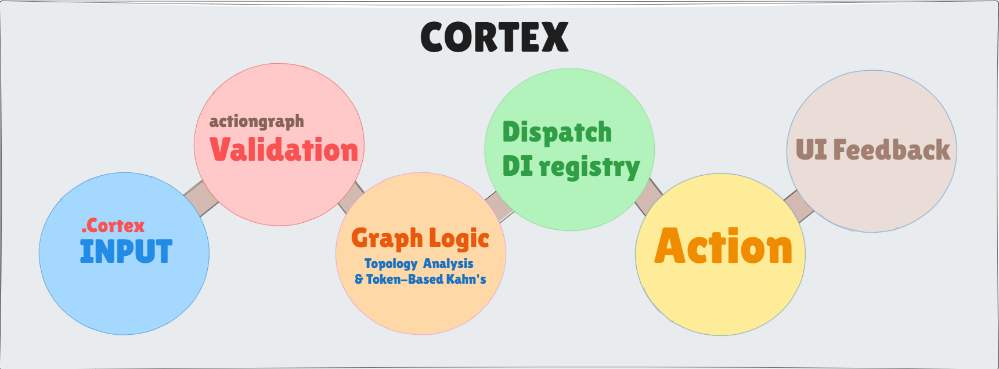
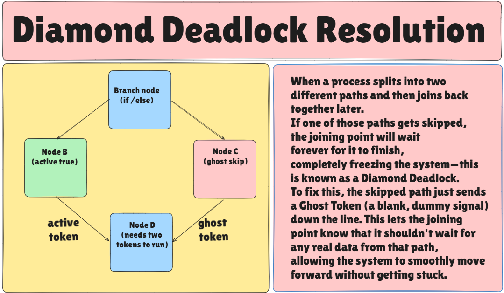

# Cortex-deterministic automation tool

Traditional UI automation tools break when a website redesigns a button, an unexpected modal pop-up appears, or an enterprise app runs inside a virtual desktop (Citrix/RDP) where DOM selectors do not exist.

**Cortex** is a visual robotic process automation (RPA) and intelligent desktop automation platform. It bridges the gap between deterministic physical automation and multimodal generative AI:

- **The Eyes (Computer Vision):** Cortex "sees" screens using multi-scale OpenCV template matching and Optical Character Recognition (OCR), completely independent of fragile HTML DOM trees.

- **The Brain (Multimodal LLMs ):** Cortex "thinks" and makes dynamic decisions when unexpected UI shifts occur, featuring an autonomous **self-healing engine** that re-locates altered elements and updates visual templates on the fly.

- **The Hands (Physical Device Control):** Cortex "acts" by commanding the host operating system to execute sub-pixel mouse movements, clicks, drags, scrolls, keystrokes, and clipboard events indistinguishable from a human operator.

---

# Architecture



## Cortex System Architecture: A Layer-By-Layer Breakdown

The architecture of Cortex is designed like a highly organized, automated factory. Instead of a single messy script trying to do everything at once, the system is broken down into six distinct layers. This separation ensures that the automation is resilient, easy to debug, and capable of handling complex scenarios without crashing. Below is a detailed explanation of each layer in the architecture diagram.

## .Cortex INPUT

Every automation journey begins with a blueprint. In this system, the blueprint is the `.cortex` file, which is essentially a YAML document. This file acts as the raw input containing all the instructions, variables, and node connections created by the user. The purpose of this layer is to provide a persistent storage format that can be easily shared or version-controlled. By starting with a static text file, the system ensures that the automation logic is completely detached from the runtime environment, meaning you can load, inspect, or modify the workflow before any actual execution occurs.

## Validation

Cortex uses **Pydantic** as a smart, adaptable validation layer. Because an automation workflow contains many different types of actions (like mouse clicks, keyboard typing, or reading text), Pydantic dynamically applies the correct set of rules based on the specific action type. This ensures the execution environment is completely insulated from malformed data.

Pydantic performs several critical functions in this layer:

- **Parser and Translator:** The execution engine cannot easily work with raw text (like JSON or YAML). Pydantic parses the incoming text and safely converts it into structured, usable Python data models (objects).

  _Example: A Mouse Node_
  If the raw `.cortex` file contains:

  ```yaml
  type: "mouse_click"
  x: "500"
  y: "600"
  ```

  Pydantic reads this and knows it must apply the "mouse click" rules. It automatically converts the serialized strings `"500"` and `"600"` into actual mathematical integers (`500` and `600`), packaging them into a proper `MouseClickNode` Python object ready for the engine to use.

- **Handling Version Mismatches:** If the generator is updated to output a new file format but the execution engine is still on an older version (or vice versa), Pydantic catches the schema mismatch during initialization, preventing incompatible files from loading.
- **Execution Engine Peace of Mind (Strongly Typed Data):** By acting as a strict security checkpoint at the entry point, Pydantic guarantees that the execution engine only ever deals with completely correct, strongly typed data. This eliminates the need for redundant type-checking during runtime and prevents unpredictable crashes halfway through an automation workflow.

## The Graph Traversal Engine

Unlike standard automation tools that rely on sequential scripts or basic graph execution, Cortex handles complex logic (like branching and looping) elegantly without breaking down.
Cortex uses token based kahn's algorithm traversing the actionGraph;

#### Why Normal Kahn's Algorithm Fails on If/Else Blocks

Kahn’s algorithm is a classic method to execute dependent tasks in the correct order. It works by counting how many incoming arrows (**In-Degree**) a task has. A task only runs when all its prerequisite tasks are complete.
However, this standard approach completely fails when you introduce an **If/Else condition**. If a workflow takes the "True" path, the nodes on the "False" path are skipped and never execute. Any downstream task waiting for the "False" path to finish will wait forever. The entire system freezes.

#### Solving the "Diamond Deadlock" with Ghost Tokens

Imagine a diamond-shaped workflow: A starting task splits into Task B (If True) and Task C (If False). Both B and C then connect to a final joining Task D.
Task D is waiting for 2 incoming signals (In-Degree of 2).
If the condition is True, Task B runs, but Task C does not. Task D only receives 1 out of 2 signals and waits indefinitely. This freeze is known as a **Diamond Deadlock**.


_(Image: A visual representation of the Diamond Deadlock condition and how tokens resolve it)_

**The Token Solution:**
Cortex fixes this by introducing a **Token-Passing** system. Think of tokens as relay batons.

- When the condition chooses Task A, it passes an **Active Token** (a green light to execute) to Task B.
- Crucially, it passes a **Ghost Token** (a skip signal) to the bypassed Task C.
  Task C receives the Ghost Token, realizes it was skipped, does not execute its action, but gracefully passes a Ghost Token forward to Task D.
  Task D now receives 1 Active Token (from B) and 1 Ghost Token (from C). Its requirement of 2 signals is met, and it safely executes! The deadlock is broken.

#### How We Address Cycles (Loops)

Standard graph executors often crash on cycles (a loop returning to an earlier step) due to infinite recursion (Stack Overflow).
Cortex solves this cleanly using a pre-execution **Back-Edge Detection**:

1. Before running, the engine scans the graph and identifies lines that point backwards to form a loop.
2. It excludes these "back-edges" when counting the required incoming signals for a task.
3. During execution, when a loop finishes an iteration and travels across a back-edge, the engine instantly bypasses normal token rules and marks the start of the loop as "fully ready" to run again.
   By using a simple queue list instead of recursive function calls, Cortex can run loops millions of times without crashing.

---

## Dispatch DI registry

With the execution order determined, the system now needs to assign actual code to the data nodes. Think of the **Dispatch DI Registry** as a smart **matchmaker** or directory for the system.

Here is what it does in simple terms:

1. **Finding the Right Tool (The Registry):** Instead of hardwiring exactly which code handles which task, Cortex looks it up in a central directory. If you want to add a new type of task later, you just add it to this directory without having to rewrite the core engine.
2. **Giving Only What's Needed (Dependency Injection):** When a piece of code is chosen for a task, Cortex gives it _only_ the specific tools it needs (like a specific file or a piece of memory). Think of it like giving a chef exactly the ingredients they need for one recipe, rather than the whole grocery store. It keeps things clean and fast.

## Action

This is the physical execution layer where virtual instructions translate into real-world computer interactions. It acts as the system's body by combining a perception system (the "eyes") with physical actuators (the "hands").

Rather than relying on website code like HTML or DOM elements, which can easily break, this layer isolates the operating system's environment from the underlying logic of the workflow.

### How OpenCV and PyAutoGUI Work Together

You might wonder how Cortex actually locates and clicks elements. It relies on a seamless collaboration between two specific tools:

1. **Screen Capture:** PyAutoGUI takes a high-speed screenshot of your entire display.
2. **The Search (OpenCV):** Instead of checking pixels one by one, the screenshot is passed to OpenCV. Using advanced mathematics, OpenCV scans the image and pinpoints the exact coordinates of your target element in milliseconds.
3. **The Action (PyAutoGUI):** Once the coordinates are found, PyAutoGUI takes control. It tells your operating system to move the actual mouse cursor to the target and executes human-like clicks, drags, or keystrokes.

### Autonomous Self-Healing

Traditional visual automation bots are fragile. If a website changes a button's design, or shifts an element by a few pixels, the bot fails and crashes. A human operator then has to manually capture new screenshots to fix it.

Cortex solves this by acting more like a human user:

- **The Fast Look (OpenCV):** By default, Cortex quickly scans the screen for the exact image. If it finds the target, it interacts with it instantly.
- **The Smart Look (AI Fallback):** If the interface has been updated and the exact image is missing, Cortex does not crash. It pauses, takes a screenshot of the entire page, and asks a smart Vision AI: _"The original button is missing. Can you find the new one?"_ By understanding the context of the screen, the AI locates the updated button.
- **The Auto-Heal (Updating Memory):** Once the AI finds the new button, Cortex automatically crops a picture of this new element and updates its own visual memory. The next time the process runs, it already knows what the new button looks like and skips the AI entirely.

**The Result:** Your automation repairs its own broken workflows in real-time. This eliminates manual maintenance, prevents unexpected crashes, and avoids recurring AI API costs.

---

## UI Feedback

While the heavy lifting of the automation runs entirely in the background, the user needs to know what is happening. The UI feedback layer bridges the gap between the invisible background engine and the user interface using an asynchronous event bus.

### Powered by PyQt6 Signals and Slots

Under the hood, this event bus is built entirely on **PyQt6's Signals and Slots** mechanism. Because GUI frameworks can crash if the interface is updated directly from a background process, Cortex uses a robust threading architecture to safely communicate state changes:

1. **The Worker Thread:** The execution engine runs on a dedicated background `QThread`. Whenever a node starts, finishes, or throws an error, this worker thread safely broadcasts telemetry by emitting custom `pyqtSignal` events.
2. **The GUI Slots:** The main thread (the frontend canvas) connects to these signals using slots.
3. **Asynchronous Updates:** When the engine emits a telemetry signal, the PyQt6 event loop processes it natively on the main thread.

This strictly one-way, asynchronous communication allows the interface to highlight active nodes, animate data flow, and display live logs in real time. Because the backend execution and the frontend rendering are decoupled via these signals, the application remains completely smooth and responsive, no matter how intensely the background engine is working.
